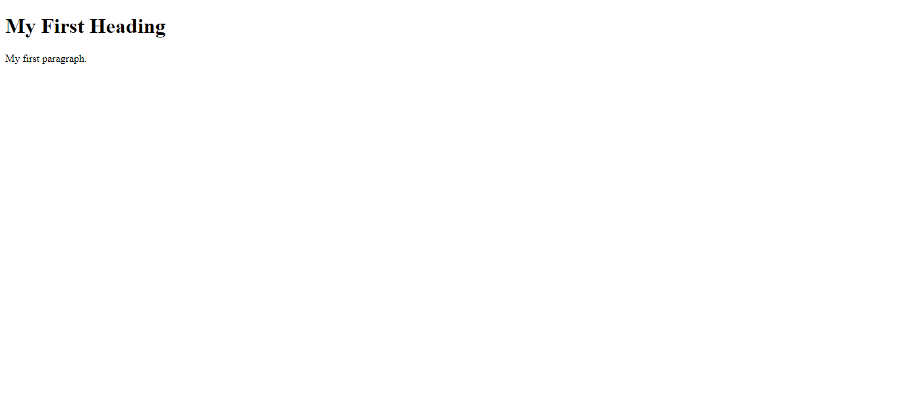
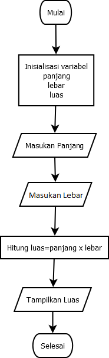

# Writing and Presentations Week 1

## 1. Unix Commands Line

- Shell adalah program yang membaca perintah dari keyboard dan mengeksekusinya. Shell biasanya berupa program yang berjalan di atas sistem operasi.

- Command Line Interface (CLI) adalah sebuah program yang berjalan di atas sistem operasi yang memungkinkan pengguna untuk berinteraksi dengan sistem operasi menggunakan perintah-perintah tertentu.

- Cara mengakakses CLI yaitu dengan menekan tombol `Windows` pada keyboard lalu ketik `cmd` pada kolom pencarian. Setelah itu akan muncul jendela baru yang berisi CLI.

- File System Structure adalah sebuah struktur data yang digunakan untuk menyimpan file dan folder. File System Structure terdiri dari 2 bagian yaitu Root dan Home.

### - Navigation files dan directory

- `pwd` untuk mengetahui lokasi direktori yang sedang aktif
- `ls` untuk menampilkan isi direktori yang sedang aktif
- `cd` untuk berpindah direktori
- `cd ..` untuk berpindah ke direktori sebelumnya
- `cd ~` untuk berpindah ke direktori home
- `cd /` untuk berpindah ke direktori root
- `cd -` untuk berpindah ke direktori sebelumnya
- `mkdir` untuk membuat direktori baru.

### - Manipulasi files dan directory

- `touch` untuk membuat file baru
- `cp` untuk mengcopy file
- `mv` untuk memindahkan file
- `rm` untuk menghapus file
- `rmdir` untuk menghapus direktori
- `rm -r` untuk menghapus direktori beserta isinya
- `rm -rf` untuk menghapus direktori beserta isinya tanpa konfirmasi.

# 2. Git dan Github

- Git adalah sebuah sistem pengontrol versi (Version Control System) pada proyek perangkat lunak yang diciptakan oleh Linus Torvalds. Git adalah salah satu sistem pengontrol versi terdistribusi (Distributed Version Control System) pada proyek perangkat lunak yang berfokus pada kecepatan.

- Github adalah sebuah layanan web yang menyediakan layanan hosting untuk proyek yang menggunakan sistem pengontrol versi Git. Github juga menyediakan layanan untuk pengembangan proyek dengan menggunakan fitur-fitur seperti pelacakan bug, permintaan fitur, manajemen tugas, dan wiki untuk setiap proyek.

- Git dan Github wajib digunakan untuk mengelola proyek yang sedang dikerjakan. Git dan Github juga digunakan untuk mengelola proyek yang sudah selesai dikerjakan.

- Alur kerja dari Git dan Github adalah sebagai berikut:
  1. Membuat repository di Github
  2. Clone repository di Github ke local
  3. Membuat file di local
  4. Menambahkan file ke staging area
  5. Commit file ke repository lokal
  6. Push file ke repository Github
  7. Melakukan perubahan pada file di local
  8. Menambahkan perubahan ke staging area
  9. Commit perubahan ke repository lokal
  10. Push perubahan ke repository Github
  11. Melakukan perubahan pada file di Github
  12. Pull perubahan ke repository lokal

# 3. HTML

- HTML adalah singkatan dari HyperText Markup Language. HTML adalah bahasa markup yang digunakan untuk membuat sebuah halaman web. HTML digunakan untuk menentukan struktur halaman web, seperti judul, paragraf, gambar, dan lain-lain.

- Stuktur HTML

```
<!DOCTYPE html>
<html>
  <head>
    <title>Page Title</title>
  </head>
  <body>
    <h1>My First Heading</h1>
    <p>My first paragraph.</p>
  </body>
</html>
```

- Mebmbuka HTML yang suda dibuat menggukan extension live server pada VS Code.
  

- Element HTML adalah sebuah tag yang digunakan untuk menentukan struktur halaman web. Element HTML terdiri dari 2 bagian yaitu tag pembuka dan tag penutup. Tag pembuka ditandai dengan tanda kurung kurawal dan tag penutup ditandai dengan tanda kurung kurawal dengan tanda garis miring (/) di depannya.
  contoh `<p>Ini adalah tag HTML</p>`.

- Attribute HTML adalah sebuah atribut yang digunakan untuk menambahkan informasi tambahan pada sebuah element HTML. Attribute HTML ditulis di dalam tag pembuka element HTML.
  attribute HTML ada tiga yaitu id attribute, class attribute, dan style attribute.
  contoh `<p class="text">Ini adalah Att HTML</p>`.

<!-- Tag-tag HTML yg sering digunakan -->

- Tag HTML yang sering digunakan adalah sebagai berikut:

  - `<h1>` hingga `<h6>` untuk menentukan judul
  - `<p>` untuk menentukan paragraf
  - `<br>` untuk membuat baris baru
  - `<hr>` untuk membuat garis horizontal
  - `<b>` untuk membuat teks tebal
  - `<i>` untuk membuat teks miring
  - `<u>` untuk membuat teks bergaris bawah
  - `<a>` untuk membuat link
  - `` untuk menampilkan gambar
  - `<ul>` untuk membuat daftar tak berurut
  - `<ol>` untuk membuat daftar berurut
  - `<li>` untuk membuat item daftar
  - `<table>` untuk membuat tabel
  - `<tr>` untuk membuat baris tabel
  - `<th>` untuk membuat judul tabel
  - `<td>` untuk membuat sel tabel
  - `<form>` untuk membuat form
  - `<input>` untuk membuat input
  - `<button>` untuk membuat tombol

- Tag HTML yang sering digunakan adalah sebagai berikut:
  - `<header>` untuk menentukan header
  - `<nav>` untuk menentukan navigasi
  - `<main>` untuk menentukan konten utama
  - `<section>` untuk menentukan bagian
  - `<article>` untuk menentukan artikel
  - `<aside>` untuk menentukan konten sampingan
  - `<footer>` untuk menentukan footer

# 4. CSS

- CSS adalah singkatan dari Cascading Style Sheets. CSS adalah bahasa style sheet yang digunakan untuk mengatur tampilan dari sebuah halaman web. CSS digunakan untuk mengatur warna, font, ukuran, dan lain-lain.

- Cara penyisipan CSS di HTML adalah sebagai berikut:

  - Inline CSS :

    ```
    <p style="color: red;">Ini adalah paragraf</p>
    ```

  - Internal CSS :
    ```
    <head>
      <style>
        p {
          color: red;
        }
      </style>
    </head>
    ```
  - External CSS : CSS yang disisipkan di dalam file terpisah dengan ekstensi. contoh code CSS di file terpisah :

        ```
        body {
          background-color: red;
        }
        ```

        cara menyisipkan CSS di HTML :

        ```
        <head>
          <link rel="stylesheet" href="style.css">
        </head>
        ```

- CSS Selector adalah sebuah cara untuk memilih element HTML yang akan diberikan style CSS. CSS Selector terdiri dari 4 jenis yaitu CSS Selector Element, CSS Selector ID, CSS Selector Class, dan CSS Selector Universal.

  - CSS Selector Element adalah sebuah cara untuk memilih element HTML berdasarkan nama tag HTML. contoh CSS Selector Element :

    ```
    p {
      color: red;
    }
    ```

  - CSS Selector ID adalah sebuah cara untuk memilih element HTML berdasarkan id attribute. contoh CSS Selector ID :

    ```
    #text {
      color: red;
    }
    ```

  - CSS Selector Class adalah sebuah cara untuk memilih element HTML berdasarkan class attribute. contoh CSS Selector Class :

    ```
    .text {
      color: red;
    }
    ```

  - CSS Selector Universal adalah sebuah cara untuk memilih semua element HTML. contoh CSS Selector Universal :

        ```
        * {
          color: red;
        }
        ```

    <!-- CSS FLEXBOX -->

- CSS Flexbox adalah sebuah cara untuk mengatur layout dari sebuah halaman web. CSS Flexbox terdiri dari 2 jenis yaitu CSS Flexbox Container dan CSS Flexbox Item.

  - CSS Flexbox Container adalah sebuah cara untuk mengatur layout dari element HTML yang berisi element HTML lainnya. CSS Flexbox Container terdiri dari 3 properti yaitu display, flex-direction, dan flex-wrap.

    - Display : properti ini digunakan untuk mengatur tampilan dari element HTML menjadi flexbox container.
    - flex-direction : properti ini digunakan untuk mengatur arah dari flexbox container.
    - flex-wrap : properti ini digunakan untuk mengatur apakah flexbox container akan memecah element HTML yang tidak muat ke baris baru.

  - Aligment : properti ini digunakan untuk mengatur posisi dari element HTML di dalam flexbox container.

    - justify-content : properti ini digunakan untuk mengatur posisi dari element HTML di dalam flexbox container.
    - align-items : properti ini digunakan untuk mengatur posisi dari element HTML di dalam flexbox container.
    - align-content : properti ini digunakan untuk mengatur posisi dari element HTML di dalam flexbox container.

  - CSS Flexbox Item adalah sebuah cara untuk mengatur layout dari element HTML yang berada di dalam flexbox container. CSS Flexbox Item terdiri dari 6 properti yaitu order, flex-grow, flex-shrink, flex-basis, align-self, dan flex.

    - order : properti ini digunakan untuk mengatur urutan dari flexbox item.
    - flex-grow : properti ini digunakan untuk mengatur ukuran dari flexbox item.
    - flex-shrink : properti ini digunakan untuk mengatur ukuran dari flexbox item.
    - flex-basis : properti ini digunakan untuk mengatur ukuran dari flexbox item.
    - align-self : properti ini digunakan untuk mengatur posisi dari flexbox item.
    - flex : properti ini digunakan untuk mengatur ukuran dari flexbox item.

# 5. Algoritma

- Algoritma adalah langkah-langkah yang jelas dan sistematis untuk menyelesaikan suatu masalah. Algoritma terdiri dari 3 bagian yaitu input, proses, dan output.

- Manfaat algoritma adalah sebagai berikut:

  - Mempermudah dalam menyelesaikan masalah
  - Mempermudah dalam memecahkan masalah
  - Mempermudah dalam mengkomunikasikan masalah
  - Mempermudah dalam mengembangkan program

- Contoh algoritma sederhana adalah sebagai berikut:

  - Menghitung luas persegi panjang

    ```
    1. Mulai
    2. Masukkan nilai panjang
    3. Masukkan nilai lebar
    4. Hitung luas persegi panjang dengan rumus panjang x lebar
    5. Tampilkan luas persegi panjang
    6. Selesai
    ```

- Penerapan dalam codingan

        ```
        function luasPersegiPanjang(panjang, lebar) {
        return panjang * lebar;
        }

        console.log(luasPersegiPanjang(10, 5));
        ```

- Cara presentasikan algoritma adalah sebagai berikut:

  - Flowchart
    - 
  - Pseudocode
    ```
    program luas persegi panjang
    deklarasi panjang, lebar, luas
    masukkan panjang
    masukkan lebar
    luas = panjang * lebar
    tampilkan luas
    ```

# 6. Javascript

- Javascript adalah bahasa pemrograman yang digunakan untuk membuat website menjadi lebih interaktif. Javascript terdiri dari 2 bagian yaitu client-side dan server-side.

- Manfaat Javascript adalah sebagai berikut:

  - Mempermudah dalam membuat website menjadi lebih interaktif
  - Mempermudah dalam membuat website menjadi lebih dinamis
  - Mempermudah dalam membuat website menjadi lebih responsif

- Cara menggunakan Javascript adalah sebagai berikut:
  - Menggunakan tag script
  ```
  <script>
     alert("Hello World");
  </script>
  ```
  - Menggunakan tag script dengan external file
  ```
  <script src="script.js"></script>
  ```
- Tipe data Javascript adalah sebagai berikut:

  - Number : tipe data ini digunakan untuk menyimpan angka.
  - String : tipe data ini digunakan untuk menyimpan teks.
  - Boolean : tipe data ini digunakan untuk menyimpan nilai true atau false.
  - Array : tipe data ini digunakan untuk menyimpan kumpulan data.
  - Object : tipe data ini digunakan untuk menyimpan kumpulan data dengan nama masing-masing data.

- Operator Javascript adalah sebagai berikut:

  - Operator Aritmatika : operator ini digunakan untuk melakukan operasi matematika.
    contoh :

  ```
  +, -, *, /, %, ++, --
  ```

  - Operator Perbandingan : operator ini digunakan untuk melakukan perbandingan.
    contoh :

  ```
    ==, ===, !=, !==, >, <, >=, <=
  ```

  - Operator Logika : operator ini digunakan untuk melakukan operasi logika.
    contoh :

  ```
   &&, ||, !
  ```

- conditional Javascript dan contohnya :

  - if

  ```
  if (condition) {
      // code
  }
  ```

  - if else

  ```
  if (condition) {
      // code
  } else {
      // code
  }
  ```

  - if else if

  ```
  if (condition) {
      // code
  } else if (condition) {
      // code
  } else {
      // code
  }
  ```

  - switch

  ```
  switch (expression) {
      case x:
      // code
      break;
      case y:
      // code
      break;
      default:
      // code
  }
  ```

- looping Javascript dan contohnya :
  - for
  ```
  for (let i = 0; i < 10; i++) {
      // code
  }
  ```
  - while
  ```
  let i = 0;
  while (i < 10) {
      // code
      i++;
  }
  ```
  - do while
  ```
  let i = 0;
  do {
      // code
      i++;
  } while (i < 10);
  ```
